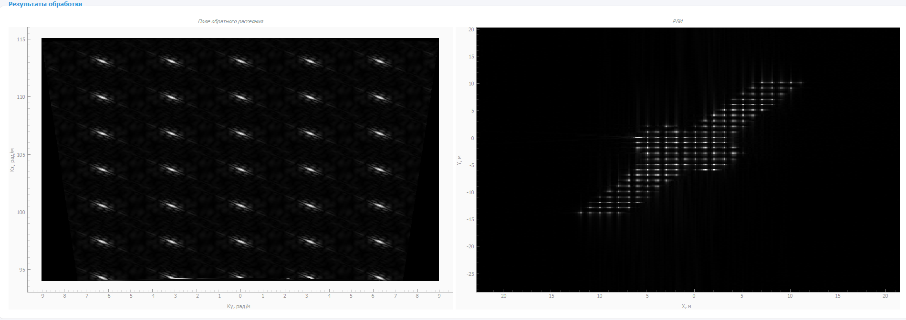
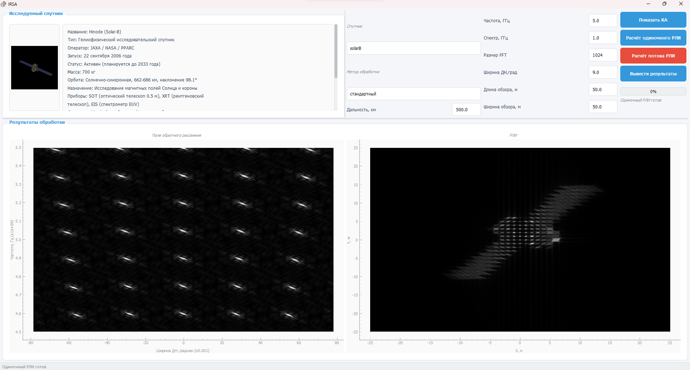

# IRSA — Радиолокационные Изображения

<p align="center">
  <br>
  
</p>

[](https://www.python.org/)
[](https://www.riverbankcomputing.com/software/pyqt/)
[](LICENSE)

---

**IRSA** — десктопное приложение для формирования и обработки радиолокационных изображений (РЛИ) космических аппаратов на основе моделей рассеяния.

На сегодняшний день в открытом доступе практически отсутствуют готовые программные комплексы для моделирования радиолокационных изображений. Большинство существующих решений либо являются коммерческими продуктами с закрытым исходным кодом, либо требуют глубоких знаний радиофизики и программирования для самостоятельной реализации.

Ещё одна сложность — отсутствие в открытом доступе исходных данных. Матрицы рассеяния (координаты и интенсивности центров рассеяния объектов) обычно являются результатом дорогостоящих измерений или моделирования, поэтому не публикуются вместе с программным обеспечением.

Программа позволяет моделировать процесс формирования двумерного радиолокационного изображения, используя заданные параметры радиолокационной системы и координаты центров рассеяния модели объекта. IRSA решает обе проблемы: приложение распространяется вместе с набором данных для 5 моделей космических аппаратов, что позволяет сразу начать работу без поиска и подготовки исходных данных.

## Зачем нужно IRSA

IRSA может использоваться для:

- 📚 **Обучения** — визуализация процессов формирования РЛИ
- 🔬 **Исследований** — анализ влияния параметров на качество изображения  
- 🛰️ **Моделирования** — отработка алгоритмов перед использованием реальных данных
- 📊 **Визуализации** — получение наглядных результатов для отчётов

> **Примечание:** В приложении используются модели космических аппаратов, а не реальные данные ДЗЗ. Матрицы содержат координаты и интенсивности центров рассеяния, которые были получены путём моделирования.

## Возможности

- 📡 **Моделирование обратного рассеяния** — расчёт поля обратного рассеяния от сложных объектов
- 🖼️ **Построение РЛИ** — генерация двумерных радиолокационных изображений
- 🛰️ **Модели спутников** — работа с моделями различных КА:
  - CloudSAT
  - CALIPSO
  - ICESat-2
  - LRO
  - Solar-B
- ⚙️ **Настраиваемые параметры** — частота, спектр, ширина диаграммы направленности, размер обзора, дальность до КА
- 🔄 **Два метода обработки** — стандартный и с полярным переформатированием
- 📊 **Визуализация** — отображение результатов в реальном времени
- 💾 **Сохранение результатов** — экспорт изображений в PNG

## Как это работает

```
.mat файлы → Target → DataProcessor → base_method/polar_method → РЛИ
                ↑                                    ↑
           Параметры                            Преобразование Фурье
           (частота, дальность,                + интерполяция
            размер обзора)
```

### Методы обработки

Для формирования РЛИ используются два метода:

1. **Стандартный** — прямое 2D обратное преобразование Фурье
2. **Полярное переформатирование** — интерполяция в декартову сетку + FFT

## Входные данные

### Доступные модели

Приложение поставляется с файлами данных для 5 моделей космических аппаратов:

- **cloudSAT** — спутник дистанционного зондирования
- **calipso** — лидарный спутник
- **ICESat-2** — лазерный альтиметр
- **LRO** — лунный орбитальный зонд
- **solarB** — солнечная обсерватория

### Именование файлов

Файлы данных именуются по принципу:

```
matrices_{satellite}_{resolution}.pkl
```

| Параметр | Значение |
|----------|----------|
| `{satellite}` | Модель КА: cloudSAT, calipso, ICESat2, LRO, solarB |
| `{resolution}` | Количество точек: high (много), mid (средне), low (мало) |

**Примечание:** Суффикс `high/mid/low` обозначает не тип орбиты, а количество точек (центров рассеяния) в файле:
- `high` — много точек (~180-200)
- `mid` — среднее количество (~50-80)
- `low` — мало точек (~10-20)

### Формат данных

Каждый `.pkl` файл содержит список из 24 кадров. Для обработки используются первые 16 кадров (0-15).

**Структура одного кадра:**
```
[intens, x, y]
```

| Поле | Тип | Описание |
|------|-----|---------|
| `intens` | list of uint8 | Интенсивности центров рассеяния |
| `x` | numpy.ndarray | Координаты по оси X |
| `y` | numpy.ndarray | Координаты по оси Y |

### Примеры данных

**solarB_high.pkl** (много точек, высокое разрешение):

| Кадр | Точек | Диапазон X | Диапазон Y |
|-------|-------|-----------|-----------|
| 0 | 182 | 0-24 | 0-23 |
| 8 | 177 | 5-21 | 0-24 |
| 15 | 89 | 8-17 | 6-17 |

**solarB_low.pkl** (мало точек, низкое разрешение):

| Кадр | Точек | Диапазон X | Диапазон Y |
|-------|-------|-----------|-----------|
| 0 | 16 | 0-6 | 0-6 |
| 8 | 13 | 2-5 | 0-6 |
| 15 | 9 | 2-4 | 2-4 |

> В приложении по умолчанию используются файлы с суффиксом `high` (максимальное количество точек).

## Особенности проекта

- 🎯 **Модульная архитектура** — каждый компонент отвечает за свою задачу (загрузка, параметры, обработка, сохранение)
- 🔧 **Настраиваемость** — легко добавить новые методы обработки или модели
- 📦 **Переносимость** — работает на Windows, macOS, Linux
- 🧩 **Расширяемость** — можно легко добавить новые модели спутников

## Скриншоты

<p align="center">
  
</p>

*Результат расчёта одиночного РЛИ*

## Установка

### Требования

- Python 3.10+
- Windows/macOS/Linux

### Клонирование репозитория

```bash
git clone https://github.com/yourusername/irsa.git
cd irsa
```

### Установка зависимостей

```bash
# Создание виртуального окружения (рекомендуется)
python -m venv .venv

# Активация
# Windows:
.venv\Scripts\activate
# macOS/Linux:
source .venv/bin/activate

# Установка зависимостей
pip install -r requirements.txt
```

### Запуск

```bash
python main.py
```

## Использование

### Быстрый старт

1. **Выберите модель спутник** — в раскрывающемся списке "Спутник"
2. **Настройте параметры радиолокатора:**
   - Частота (ГГц)
   - Спектр (ГГц)
   - Размер FFT
   - Ширина ДН (градусы)
   - Размер обзора (м)
   - Дальность (км)
3. **Нажмите "Расчёт потока РЛИ"** — для обработки всех кадров
4. **Нажмите "Вывести результаты"** — для просмотра анимации

### Пример результата

```
Обработано: 16 кадров
Время обработки: ~30 секунд
Формат вывода: PNG (1024x1024)
```

## Структура проекта

```
IRSA/
├── main.py              # Точка входа
├── config.py           # Конфигурация приложения
├── filenames.py       # Работа с файлами матриц
├── processing.py      # Обработка данных
├── parametrs.py      # Параметры волны
├── target.py         # Загрузка данных целей
├── RLI.py           # Методы обработки
├── setup.py         # Установка пакета
├── requirements.txt # Зависимости
├── LICENSE         # Лицензия MIT
├── README.md       # Документация
├── CHANGELOG.md    # История версий
├── CONTRIBUTING.md # Для контрибьюторов
├── .gitignore     # Исключение файлов
├── config.json    # Настройки пользователя
├── icon.ico       # Иконка приложения
│
├── ui/            # Интерфейс
│   ├── main_window.py
│   ├── dialogs.py
│   ├── styles.py
│   ├── widgets.py
│   └── __init__.py
│
├── matrices/      # Данные моделей (.pkl)
│
├── sat_info_p/     # Информация о спутниках
│
├── assets/        # Изображения для README
│
└── radioimage/   # Результаты (создаётся при работе)
```

## Конфигурация

Параметры сохраняются в `config.json`:

```json
{
  "method": "стандартный",
  "center_frequency": 8.0,
  "spectrum_width": 0.5,
  "nifft_size": 1024,
  "beam_width": 9.0,
  "survey_length": 20.0,
  "survey_width": 20.0,
  "satellite": "solarB",
  "range_km": 500.0
}
```

## Участие в разработке

PR и issue приветствуются!

## Лицензия

Проект распространяется под [лицензией MIT](LICENSE).

---
