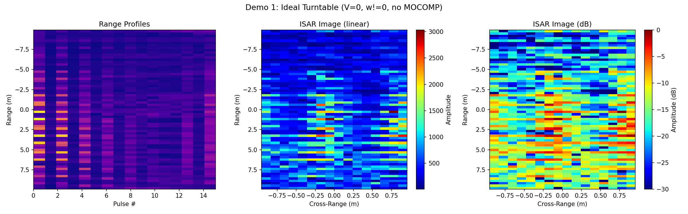
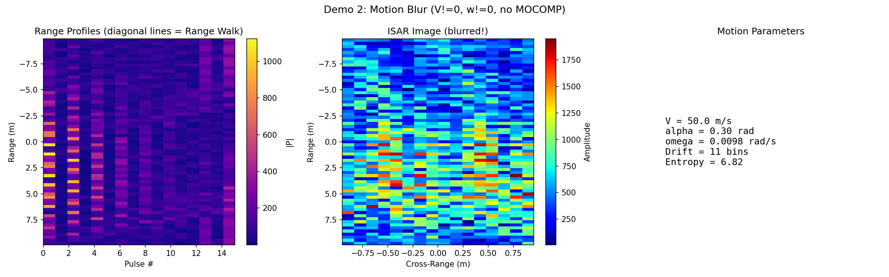
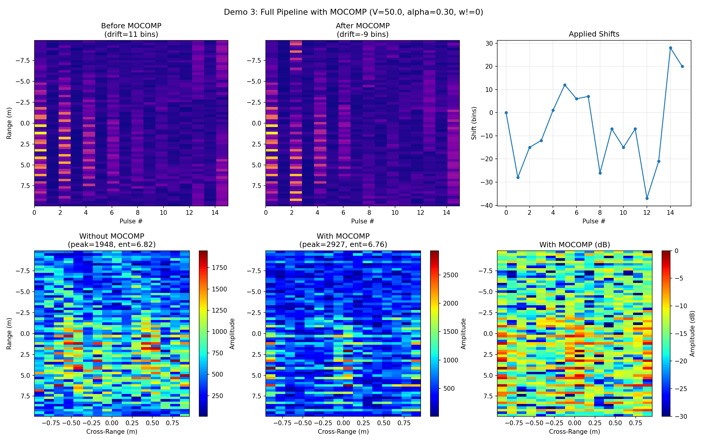
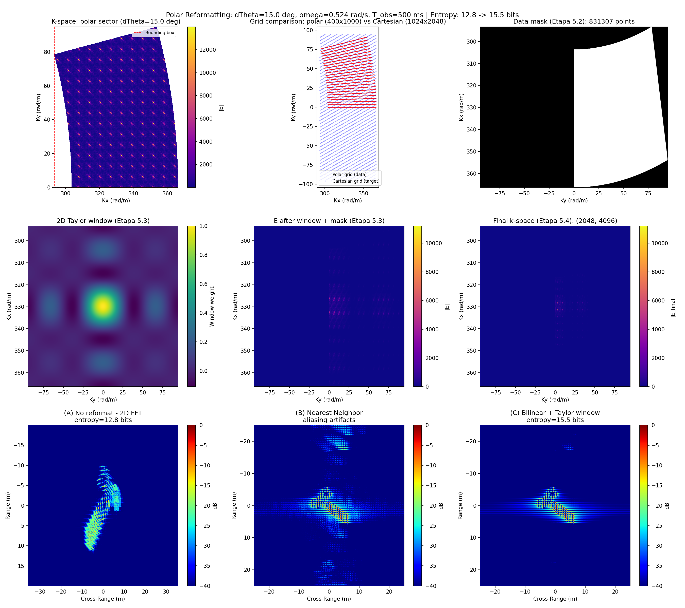
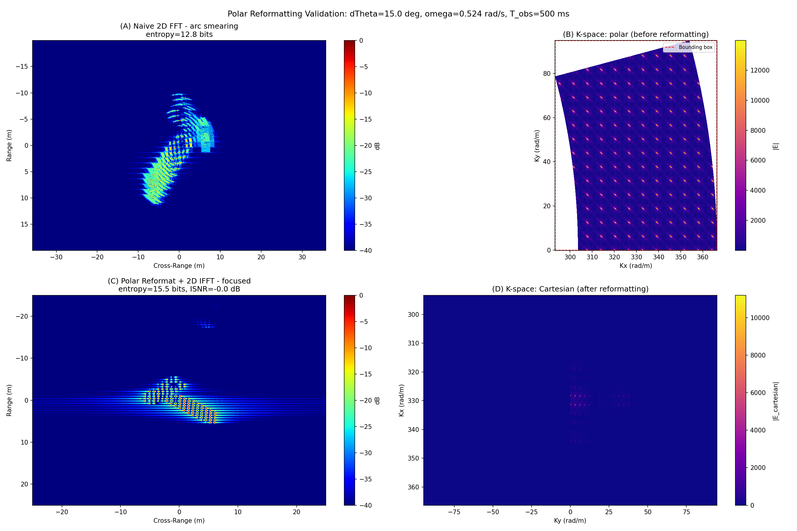
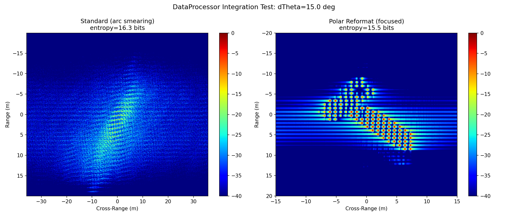

# Демо-скрипты и тесты

Папка `examples/` содержит 6 готовых скриптов для визуализации алгоритмов ISAR-обработки. Каждый скрипт запускается из корня проекта и автоматически сохраняет PNG-картинку в эту же директорию.

**Запуск из корня проекта:**

```bash
python -m examples.<имя_скрипта>
```

**Все скрипты сразу:**

```bash
python -m examples.demo_ideal_turntable
python -m examples.demo_motion_blur
python -m examples.demo_full_pipeline_mocomp
python -m examples.demo_large_angle
python -m examples.demo_polar_reformatting_validation
python -m examples.test_data_processor_polar
```

---

## Демо 1: Идеальный разворот (Turntable Model)

**Скрипт:** `demo_ideal_turntable.py`

**Сценарий:** чистое вращение вокруг ЦМ без поступательного движения (V=0). MOCOMP не нужен — РЛИ формируется идеально.

**Что показывает:** базовая корректность конвейера. Если вращение единственная динамика, радар без труда разделяет точки по азимуту через FFT.

**Параметры:** `satellite=ICEsat2`, `ω=0.524 рад/с`, `N=1000`, `PRI=0.5 мс`, `B=1.5 ГГц`, `X/Y=40/30 м`

**Выход:** `demo_ideal_turntable.png`



---

## Демо 2: Размытие движением (Motion Blur)

**Скрипт:** `demo_motion_blur.py`

**Сценарий:** поступательное движение ЦМ (V=50 м/с) + вращение. MOCOMP **выключен**.

**Что показывает:** что происходит без компенсации движения:
- На профилях дальности — косые линии (Range Walk): каждая точка «ползёт» по бинам дальности от импульса к импульсу.
- РЛИ полностью размыто, точки цели не различимы.

**Параметры:** `satellite=ICEsat2`, `V=50 м/с`, `ω=0.524 рад/с`, `N=1000`, `PRI=0.5 мс`

**Выход:** `demo_motion_blur.png`



---

## Демо 3: Полный конвейер с MOCOMP

**Скрипт:** `demo_full_pipeline_mocomp.py`

**Сценарий:** тот же сценарий, что и в демо 2 (V=50 м/с, ω≠0), но MOCOMP **включён**.

**Что показывает:** всю магию компенсации движения:
1. Выравнивание огибающей убирает Range Walk (косые линии превращаются в горизонтальные).
2. Фазовый автофокус убирает линейный фазовый тренд.
3. Азимутальное FFT фокусирует точки.

**Параметры:** `satellite=ICEsat2`, `V=50 м/с`, `ω=0.524 рад/с`, `N=1000`, `PRI=0.5 мс`

**Выход:** `demo_full_pipeline_mocomp.png`



---

## Демо 4: Большой угол поворота (Large Angle)

**Скрипт:** `demo_large_angle.py`

**Сценарий:** Δθ = 15° (ω=0.524 рад/с, N=1000, PRI=0.5 мс). V=0.

**Что показывает:** проблему, с которой справляется полярное переформатирование:
- **k-space:** данные лежат не на прямоугольнике, а на **кольцевом секторе** (полярная сетка).
- **Стандартное РЛИ:** точки растягиваются в **дуги** (arc smearing) — 2D БПФ на кривой сетке работает некорректно.
- **Полярная сетка vs декартова:** наглядное сравнение до и после переформатирования.

**Параметры:** `satellite=ICEsat2`, `ω=0.524 рад/с`, `Δθ=15°`, `B=1.5 ГГц`, `N=1000`

**Выход:** `demo_large_angle.png`



---

## Демо 5: Валидация полярного переформатирования

**Скрипт:** `demo_polar_reformatting_validation.py`

**Сценарий:** тройное сравнение методов для одной и той же цели с Δθ=15°.

**Что показывает:** три графика в одном окне:
- **(A) Наивный 2D FFT** — точки размазаны в дуги, энтропия высокая.
- **(B) k-space: до vs после** — слева кривая полярная сетка, справа выпрямленная декартова с нулями по углам.
- **(C) Polar Reformatting + 2D IFFT** — точки сфокусированы, энтропия минимальна.

**Метрики:** энтропия снижается, ISNR растёт.

**Параметры:** `satellite=ICEsat2`, `ω=0.524 рад/с`, `Δθ=15°`, `B=1.5 ГГц`, `N=1000`, `X/Y=40/30 м`

**Выход:** `demo_polar_reformatting_validation.png`



---

## Интеграционный тест: DataProcessor + Polar Reformat

**Скрипт:** `test_data_processor_polar.py`

**Что делает:** прогоняет полный конвейер через `DataProcessor` (тот же класс, что и GUI) для стандартного и полярного методов. Автоматически проверяет:
- Изображение не пустое (`peak > 0`)
- Энергия сконцентрирована (top-1% пикселей содержат >5% энергии)
- Оси корректные (метры, не радианы)
- Размерность осей совпадает с размерностью изображения

**Выход:** `test_data_processor_polar.png` (два графика: стандартный vs полярный), вывод в консоль с метриками.

**Запуск с проверками:**

```bash
python -m examples.test_data_processor_polar
# Вывод: [OK] Image is non-empty
#        [OK] Energy is concentrated
#        [OK] Axis sizes match image dimensions
#        [OK] Physical axes: x_span=40.0 m, y_span=30.0 m
#        ALL CHECKS PASSED
```

**Выход:** `test_data_processor_polar.png`



---

## Сравнение скриптов

| Скрипт | V | MOCOMP | Δθ | Метод | Что видно |
|--------|---|--------|-----|-------|-----------|
| demo_ideal_turntable | 0 | — | 15° | стандартный | Идеальные точки |
| demo_motion_blur | 50 | выкл | 15° | стандартный | Range Walk, размытие |
| demo_full_pipeline_mocomp | 50 | вкл | 15° | стандартный | Точки после MOCOMP |
| demo_large_angle | 0 | — | 15° | стандартный + полярный | Arc smearing vs k-space |
| demo_polar_reformatting_validation | 0 | — | 15° | наивный / полярный | 3 графика сравнения |
| test_data_processor_polar | 0 | выкл | 15° | оба | Автотест с метриками |
